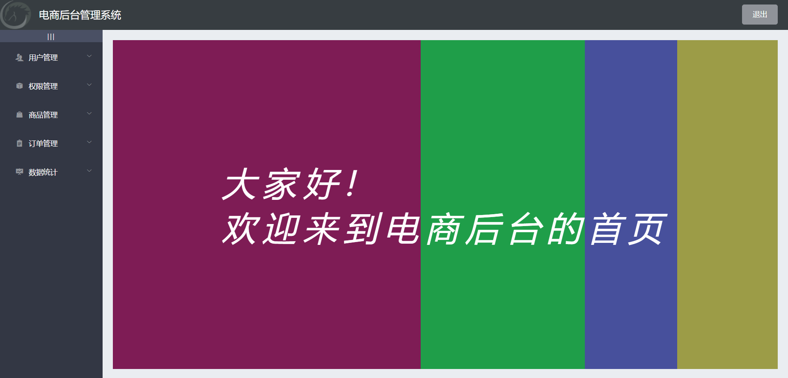

## 项目说明

- 项目名称：黑马电商后台管理系统
- 技术说明：Vue2 + ElementUI
- 项目运行

```
运行命令：运行命令：npm run serve
账号密码：admin-123456
接口地址：http://127.0.0.1:8888/api/private/v1/
Vue2：https://v2.cn.vuejs.org/
ElementUI：https://element.eleme.cn/#/zh-CN/component/installation
```

## 运行效果

- 登录页面


- 后台首页


