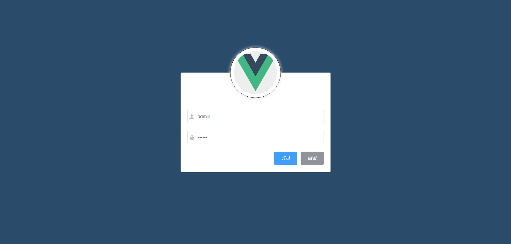

## 项目说明

- 项目名称：黑马电商后台管理系统
- 技术说明：Vue2 + ElementUI + Axios
- 项目运行

```
运行命令：运行命令：npm run serve
账号密码：admin-123456
接口地址：http://127.0.0.1:8888/api/private/v1/
Vue2：https://v2.cn.vuejs.org/
ElementUI：https://element.eleme.cn/#/zh-CN/component/installation
```

## 分支说明

| 分支名称       | 分支说明                                                     |
| -------------- | ------------------------------------------------------------ |
| master         | 项目源代码分支（运行该分支，需要先运行【vue-api-server】分支） |
| dist           | 项目预览分支                                                 |
| vue-api-server | 项目接口分支                                                 |
| vue-shop-test  | 项目测试分支（项目离线版本，脱离接口）                       |

```
克隆指定分支命令【建议不要在C盘下运行】
git clone -b 分支名 https://github.com/zhang-bcxb/zhang-heima-shop-admin.git

例如，克隆 dist 分支
git clone -b dist https://github.com/zhang-bcxb/zhang-heima-shop-admin.git

以上方法不行的话，也可以直接在 GitHub 上切换到对应分支进行下载
```

## 运行效果

- 登录页面



- 后台首页


